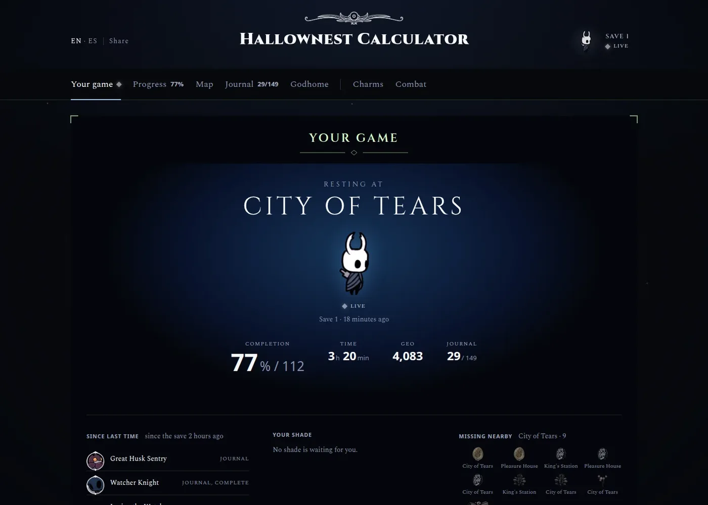
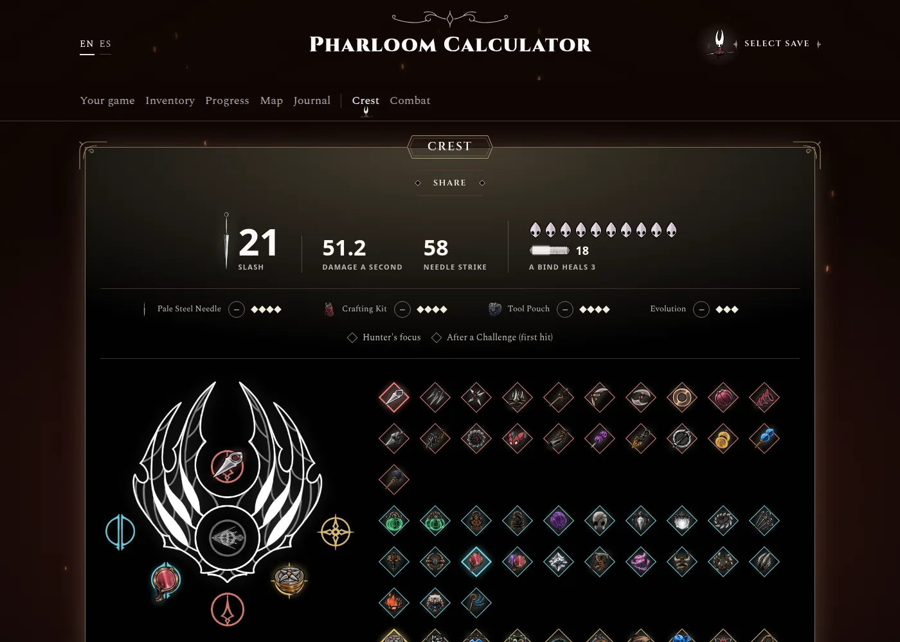

 

 

 

<table>
<tr>
<td width="50%" align="center" valign="top">

### [Hallownest Calculator](https://betorzdev.github.io/hallownest-calculator/)

*Hollow Knight: your real game, followed live, and every charm's effect on the Knight.*

The 112% item by item · the game's own map the Hunter's Journal and Godhome · builds in a fight

**[Open it](https://betorzdev.github.io/hallownest-calculator/)** · [Source](https://github.com/betorzdev/hallownest-calculator)

</td>
<td width="50%" align="center" valign="top">

### [Pharloom Calculator](https://betorzdev.github.io/pharloom-calculator/)

*Silksong: your real game, followed live, and every Tool's and Crest's effect on Hornet.*

The 100% item by item · the game's own map the Hunter's Journal · Crest builds in a fight

**[Open it](https://betorzdev.github.io/pharloom-calculator/)** · [Source](https://github.com/betorzdev/pharloom-calculator)

</td>
</tr>
</table>

 

The scenery is drawn in code; the Knight, Hornet and the HUD pieces are the games' own sprites. Hollow Knight and Hollow Knight: Silksong belong to Team Cherry.

